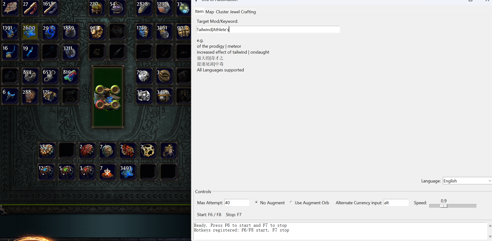
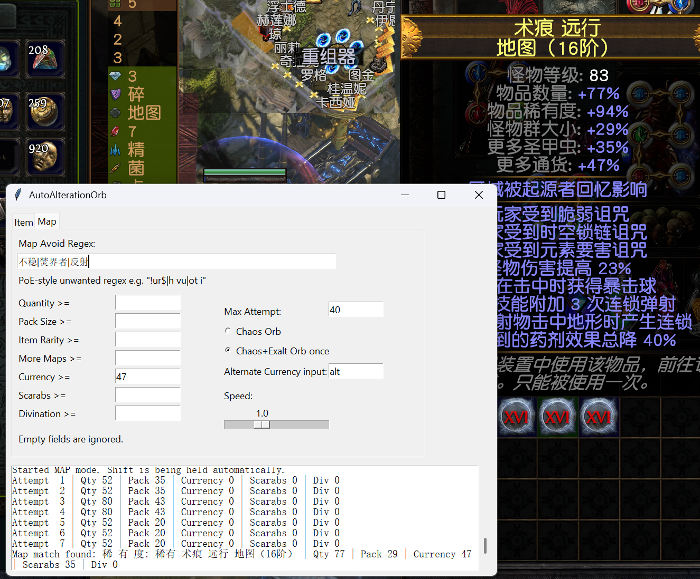
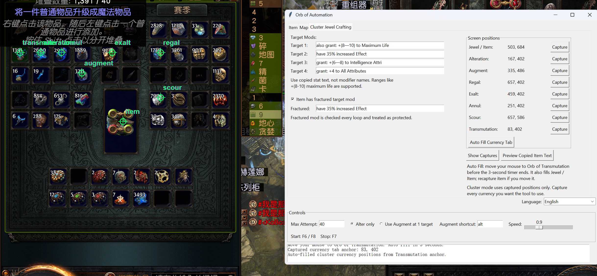

# Orb of Automation
Orb of Alteration automation tool for Path of Exile 1  
Reads item data from the clipboard (Ctrl + C) instead of game files which is not against GGG T&C :)   

# Useage 
1. Run **Orb of Automation.exe** as **Administrator** (Important)

  *Alternatively, if using python 3.8+, install dependencies:*
```bash
pip install pyautogui keyboard pyperclip
```
  *Then Run the script:*
```bash
python OrbOfAutomation.py
```

2. Key in item regex ( same format in POE, Supports all languages) and set up accordingly


3. Rightclick Orb of Alteration and hover on the item


4. Press F6 to start until getting the desired modifier

# Notes

- Works by reading clipboard text (Ctrl + C) and PyAutoGUI lib for mouse and keyboard actions  
- No direct interaction with game files  
- Adjust speed if rolls become unstable     

--------------------------------------------------
# Map roller (EN/简中/繁中)
1. Generate your regex from thirdparty websites(clean,unwanted mods only)
2. Key in regex and target Quantities
3. Right click chaos and hover on map, F6 to reroll


--------------------------------------------------
# Cluster Jewel auto crafting
1. Key in all the targets modifiers
2. Key in the fractured mod (if any)
3. Select Auto fill in currency tab , hover the mouse onto orb of transmutation after 3 seconds
4. Fill in configurationand, go back to the game and simply press F6 to start.

# Disclaimer

Not sure if GGG can detect such "unusual" currency spamming. Use at your own risk.
